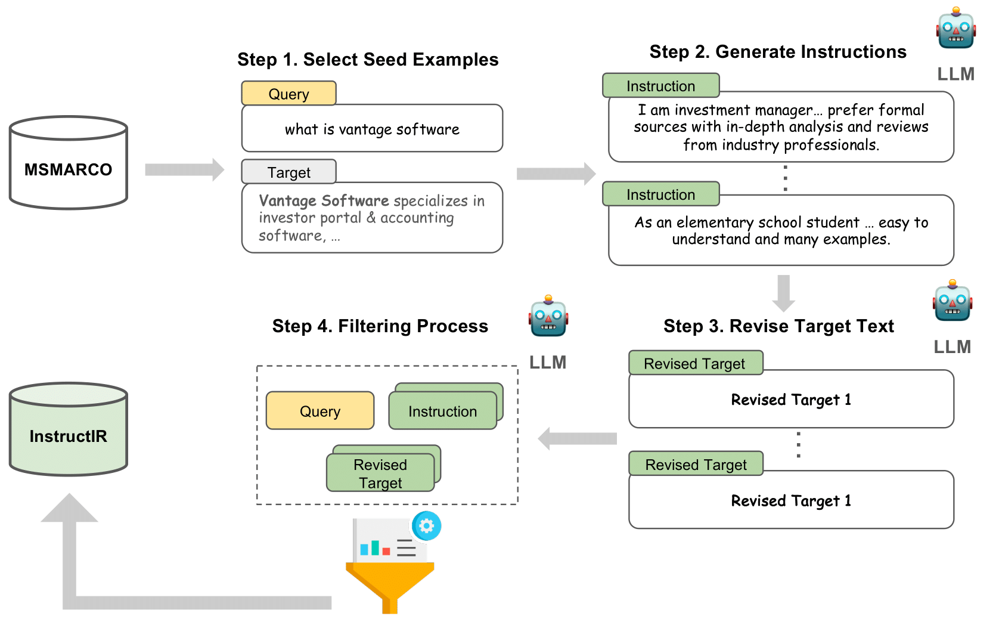

# InstructIR

Official repository for ["InstructIR: A Benchmark for Instruction Following of Information Retrieval Models"](http://arxiv.org/abs/2402.14334)

We introduce InstructIR, a novel benchmark specifically designed to evaluate the instruction following ability in information retrieval models. Our approach focuses on user-aligned instructions tailored to each query instance, reflecting the diverse characteristics inherent in real-world search scenarios.


<p align="center">
  
</p>

## Setup
```
pip install -r requirements.txt
```

## Dataset Construction Pipeline

Constructing a framework to evaluate instruction-following capabilities in information retrieval models necessitates correlating multiple instructions with the same query and adjusting their targets accordingly (i.e., instruction, query, target text). Therefore, in contrast to previous approaches that evaluate coarse-grained task description-style instructions on information retrieval datasets with up to 15 instructions, we focus on creating per-query, instance-specific instructions. We employ GPT-4 for our work to facilitate the creation of such a setting.

The development of our InstructIR evaluation datasets adheres to a systematic set of steps as shown in the figure below:

<p align="center">
  
</p>


Full pipeline codes are under [data_creation](data_creation/).


## Citation
Please cite if you use the data or code in this repo.

```
@article{oh2024instructir,
      title={INSTRUCTIR: A Benchmark for Instruction Following of Information Retrieval Models}, 
      author={Hanseok Oh and Hyunji Lee and Seonghyeon Ye and Haebin Shin and Hansol Jang and Changwook Jun and Minjoon Seo},
      year={2024},
      eprint={2402.14334},
      archivePrefix={arXiv},
      primaryClass={cs.CL}
}
```
